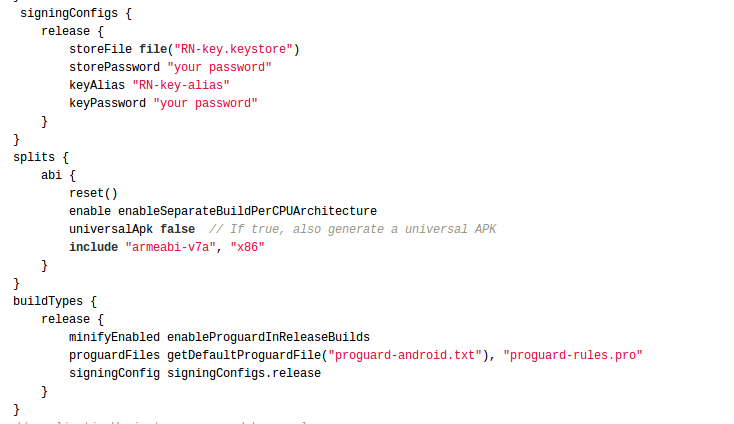
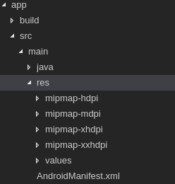

# 打包应用

假设你的应用做完了，总不能还在后台开着packager就把应用发布出去吧。很明显，我们需要让应用可以离线，下边所要讲的就是
一个让应用脱离packager的过程

## 生成签名

没签名直接打包应用是不行的，我们需要实现生成一个签名。在Linux下，我们执行这条命令：

```
keytool -genkey -v -keystore RN-key.keystore -alias RN-key-alias -keyalg RSA -keysize 2048 -validity 10000
```

然后会让你设置最少6位的密码，密码一定要记好，作者君的建议是两个密码最好不要设置成一样的~

至于Windows，我们得进到JDK目录下执行此命令，或者使用一些傻瓜式的签名生成软件。

## 修改gradle变量

将生成的RN-key.keystore放到android/app文件夹中，然后修改在android目录下的gradle.properties，

```
MYAPP_RELEASE_STORE_FILE=RN-key.keystore
MYAPP_RELEASE_KEY_ALIAS=RN-key-alias 
MYAPP_RELEASE_STORE_PASSWORD=your password
MYAPP_RELEASE_KEY_PASSWORD=your password
```

## 添加配置

修改android/app目录下的build.gradle，在`defaultConfig`代码块下增加：

```
signingConfigs {
        release {
            storeFile file("RN-key.keystore")
            storePassword your password
            keyAlias RN-key-alias 
            keyPassword your password
        }
    }
```

在buildTypes中的release下添加：

```
signingConfig signingConfigs.release
```

整体就像这样：



## 打包应用

进入项目所在目录，执行以下命令（packger应该处于开启状态）：

```
cd android && ./gradlew assembleRelease
```

Windows用户不用写`./`，漫长的等待过后，我们便可以在
android/app/build/outputs/apk下找到我们的应用了，并且这个可以发布到各大应用市场。

## 混淆及安全

为了安全（也为了缩小apk大小），我们需要启用代码混淆。进入android/app目录，然后修改build.gradle文件，
将`def enableProguardInReleaseBuilds = false`改为`def enableProguardInReleaseBuilds = true`

如果不准备同时支持ARM和X86，那么将`enableSeparateBuildPerCPUArchitecture`改为true可以给安装包减少4mb大小~

## 修改icon

进入android/app/src/main/res目录，我们可以看到有这么几个子目录：



然后把这四个目录下的图片换成别的就可以啦，尺寸要对上哟~

## 修改应用名称

假设我们想将应用的名字换成`茯苓`要怎么办呢？很简单，还是在res目录，我们进入values目录，修改strings.xml即可:

```
<resources>
    <string name="app_name">茯苓</string>
</resources>
```

