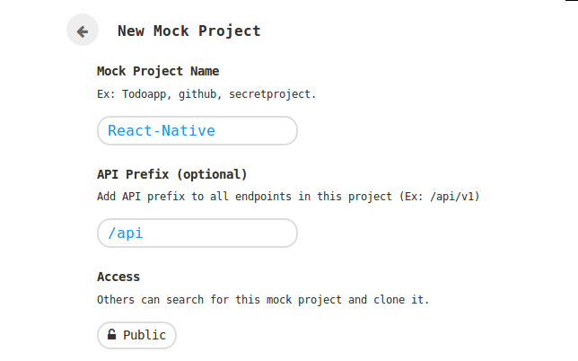
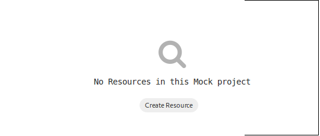
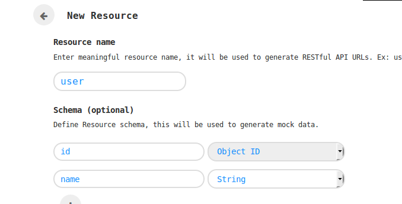
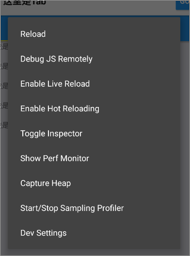

# 网络

这一章呢，不会只讲网络哦~

## Mock Api

Mock Api是一项非常棒的服务，它可以帮助我们快速的模拟后端的REST Api并且不需要你自己的服务器，甚至代码都不用写，它的网址是
http://www.mockapi.io/， 可以注册也可以使用GitHub帐号登陆。

点击`+`来创建一个项目：


填写项目名称和Api前缀(随便写就行)：



接下来点击Create Resource来创建资源：




然后填写资源名称，以及修改Schema，为了方便，我们就留下id和name：



然后点击next按钮，这一步完了之后，我们就可以通过`xxxxxxx.mockapi.io/api/user`使用REST Api了。

## Fetch

在React Native中，我们可以使用Fetch来进行网络请求，由于Fetch API天然支持Promise规范，所以我们的代码可以变得很优雅。

执行Get操作应该是最为简单的了，我们看下代码：

```
fetch('http://xxx.mockapi.io/api/user')
  .then((response) => {
    console.log(response);
  })
  .catch((err) => console.error(err);)
```

这样便可以在控制台打印出user下的所有内容。你可能会想：喵喵喵？React Native还有控制台？ 当然有啦，不过我们得打开远程调试，首先打开菜单：



然后选择Debug Js Remotely，之后便会自动打开Chrome。自己打开Chrome的控制台便可以看到`console.log`的内容了。

实际应用中，我们会在组件渲染的时候把数据丢到状态或别的地方，然后使用这些数据(一般会用作列表渲染)。不管怎么说，不会直接console就是了。

然后是Post：

```
fetch('http://xxxx.mockapi.io/api/user', {
  method: 'POST',
  headers: {
    'Accept': 'application/json',
    'Content-Type': 'application/json',
  },
  body: JSON.stringify({
    name: 'meow',
  })
})
  .then(xxxx)
  .catch((err) => console.error(err))
```

我们可以加个then来处理在Post过程中要做的事情，并用catch来获取异常。

至于Put和Delete参考Post就好啦~
